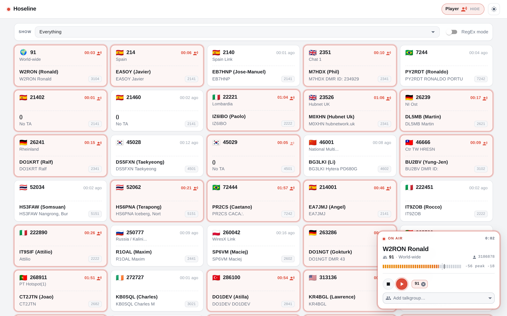
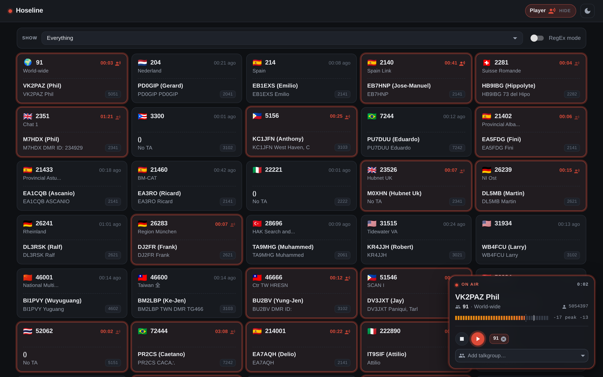

# Hoseline Redesign

This is a userscript for **https://hose.brandmeister.network/** that redraws the dashboard and turns that popover into a floating QSO card - callsign as the headline, talkgroup with its actual name, a level meter that behaves like one, and a clock on the current over.

Dark mode

## Install

Open `hoseline-redesign.user.js` with Tampermonkey (or Violentmonkey, or Greasemonkey) installed and click Install. That's it. If Chrome quietly does nothing when you drag the file into a tab, that is a Chrome policy about local files, not a broken script, and `INSTALL.txt` has the switch.

There is also `hoseline-redesign.user.css` for Stylus. You get the paint and none of the machinery: the card exists only while the popover is open, it never morphs between idle and on-air, and there is no timer, no talkgroup name, no peak marker. Dark mode follows your OS rather than the site's own toggle.

## What will break this

Everything here is glued to somebody else's React app. The card *is* the site's own popover, re-laid-out; active grid cards are found by an inline `rgb(221, 75, 57)` border; half the selectors are MUI class names. None of that is a supported integration and none of it is promised to survive a redesign upstream. When Hoseline changes, this breaks, and the fix is usually one selector in `src/hoseline.css`.

## Files

- `hoseline-redesign.user.js` - the one you install
- `hoseline-redesign.user.css` - CSS-only variant, for Stylus
- `src/hoseline.css` is the single source; `node src/build.js` regenerates both installables
- `docs/how-it-works.md` - the mechanism, and the list of things that will bite you if you edit it
- `INSTALL.txt` - install notes, including that Chrome setting
